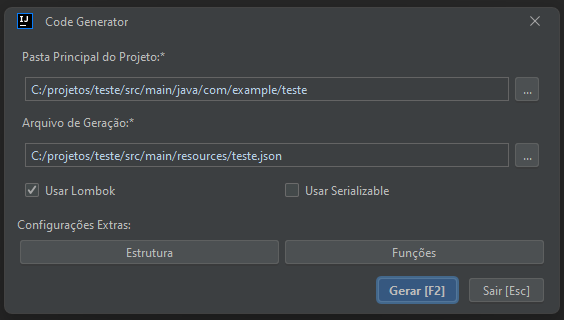

# Plugin Gerador de API Java Spring - CodeGenerator  <a href="https://plugins.jetbrains.com/plugin/22304-spring-rest-code-generator"></a>

Este plugin é um gerador de código Java Spring que permite criar APIs REST de maneira rápida e eficiente. Ele gera automaticamente as entidades, repositórios, serviços, implementações de serviço e controladores com endpoints completos de CRUDL (Create, Read, Update, Delete e List).


[](https://plugins.jetbrains.com/plugin/22304-spring-rest-code-generator)

### Requisitos

- Java 8+
- Spring 3+ previamente configurado (`spring-boot-starter`, `spring-boot-starter-data-jdbc`, `spring-boot-starter-web`, `spring-boot-starter-data-jpa`, `spring-boot-starter-validation`, ...)
- biblioteca ModelMapper (`org.modelmapper`) no pom do projeto alvo

<script src="https://plugins.jetbrains.com/assets/scripts/mp-widget.js"></script>
<script>
  MarketplaceWidget.setupMarketplaceWidget('install', 22304, "#yourelement");
</script>

```java
@Configuration
public class BeanConfig {

    @Bean
    public ModelMapper modelMapper() {
        ModelMapper modelMapper = new ModelMapper();
        modelMapper.getConfiguration().setAmbiguityIgnored(true);
        return modelMapper;
    }
}
```

## A definição de entidades segue a seguinte sintaxe de objetos:

#### Envio completo:


```java
public class RequestDTO { 
    private String apiVersion;
    private List<TableDTO> tables;
    private List<EnumDTO> enums;
}
```

```json
{
  "tables": [
    {
      "table": "Cachorro",
      "columns": [
        {
          "name": "id",
          "type": "UUID",
          "primaryKey": true
        },
        {
          "name": "raca",
          "type": "Raca"
        }
      ]
    }
  ],
  "enums": [
    {
      "name": "Raca",
      "values": ["golden", "viraLata"]
    }
  ]
}
```

### Sintaxe de definição de entidades

```java
public class TableDTO {
    private String table;
    private List<ColumnDTO> columns;
}
```

```java
public class ColumnDTO {
    private String name;
    private String type;
    private Integer length;
    private Boolean primaryKey;
    private Boolean required;
    private Boolean updatable;
    private Boolean list;
    private Boolean set;
    private Boolean unique;
    private String generationType;
    private String cardinality;
    private String enumType;
    private String mappedBy;
    private String orderBy;
    private String cascadeType;
    private String temporalType;
}
```

`apiVersion: (opcional)` Versão da api. Exemplo: `api/v1'`.

`table:` Nome da entidade (deve ser camel case e iniciar com letra Maiúscula).

`name:` Nome da coluna (deve ser camel case). No banco de dados, será convertido para snake case, seguindo as boas práticas de nomenclatura de banco.

`type:` Tipo da coluna (deve ser o exato nome da propriedade/objeto, como String, Integer, Venda, etc.).

`length (opcional, default 255):` Indica comprimento da coluna (Somente se a coluna for do tipo String).

`primaryKey (opcional, default false):` Indica que a coluna será a chave primária da entidade.

`required (opcional, default false):` Indica que a coluna é obrigatória ao cadastrar. Será adicionada a anotação `@NotNull` no DTO de persistência para garantir que o usuário informe o valor.

`updatable (opcional, default true):` Indica que a coluna pode ser atualizada. Será criado um DTO específico para atualização. Caso nenhuma propriedade possa ser atualizada, o DTO e o método de atualização correspondente não serão gerados.

`list (opcional, default false):` Indica que a coluna será uma lista.

`set (opcional, default false):` Indica que a coluna será uma set.

`unique (opcional, default false):` Indica que a coluna terá a Constraint unique.

`generationType (opcional, case insensitive):` Indica o tipo de geração da coluna que contém a anotação `@GeneratedValue`. Pode ser um dos seguintes valores: `Table`, `Sequence`, `Identity`, `UUID` ou `Auto`.

`cardinality (opcional, case insensitive):` Indica o tipo de cardinalidade da coluna. Pode ser um dos seguintes valores: `OneToMany`, `ManyToOne`, `OneToOne` ou `ManyToMany`.

`enumType (opcional, case insensitive, default STRING):` Indica a forma que a coluna de enum será persistida. Pode ser um dos seguintes valores: `String` ou `Ordinal`.

`mappedBy (opcional, case sensitive):` Usado em relacionamentos bidirecionais no JPA. Serve para indicar que o controle do relacionamento está no lado oposto da associação.

`orderBy (opcional, case sensitive):` Usado para especificar a ordenação dos elementos em uma coleção mapeada em uma entidade JPA, definindo o campo pelo qual a ordenação deve ser realizada.

`cascadeType (opcional, case insensitive):` Indica como as operações de persistência devem ser propagadas de uma entidade proprietária para suas entidades relacionadas. Pode ser um dos seguintes valores: `All`, `Persist`, `Merge`, `Remove`, `Refresh` ou `Detach`.

`temporalType (opcional, case insensitive):` Indica como campos de data e hora em uma entidade se relacionam com as colunas correspondentes no banco de dados. Pode ser um dos seguintes valores: `Date`, `Time` ou `Timestamp`.

#### Aqui está um exemplo de definição de entidade:

```json
{
  "table": "Cachorro",
  "columns": [
    {
      "name": "id",
      "type": "UUID",
      "primaryKey": true
    },
    {
      "name": "raca",
      "type": "Raca"
    }
  ]
}
```

### Sintaxe de definição de enums

A definição de enums segue a seguinte sintaxe:

```java
public class EnumDTO {
    private String name;
    private List<String> values;
}
```

`name:` Nome do enum (deve ser camel case).

`values:` Valores do enum (serão convertidos para snake case e em letras maiúsculas para atender aos padrões de enum).

#### Aqui está um exemplo de definição de enum:

```json
{
  "name": "Raca",
  "values": ["golden", "viraLata"]
}
```

### Como utilizar
Para utilizar o gerador, siga as etapas abaixo:

1- Instale o Plugin

2- Na IDE, aperte o atalho `Ctrl + Alt + G`, abrirá a seguinte modal para configuração



3 - Faça as personalizações adicionais necessárias para atender aos requisitos específicos do seu projeto e clique em `Gerar`.

### Explicação dos campos:

- `Pasta Principal do Projeto:` Pasta onde os arquivos e pastas serão criados (Pasta em que contém o arquivo com o método `main`).
- `Arquivo de Geração:` Arquivo que contém as entidades/enums a serem gerados seguindo a nomenclatura citada (`JSON`).
- `Usar Lombok:` Determina se o projeto utiliza a biblioteca Lombok. Caso marcado, `getters`, `setters` e `construtores` das entidades e DTOs serão criados com `Lombok`.
- `Usar Serializable:` Determina se as entidades já iniciarão implementando a interface `Serializable`.

### Modal de Configurações de Estrutura

Ao clicar no botão `Estrutura` da modal de Geração de Código, a seguinte modal abrirá: 


### Explicação dos campos da modal de Configurações de Estrutura:

`Prefixo da Entidade:` Define o prefixo para nomes de classes de entidade. Exemplo 'Model' ou 'Entity'.

`Pasta da Entidade (default 'entity'):` Indica o diretório onde as classes de entidade serão geradas.

`Prefixo do DTO de Persistência (default 'PersistDTO'):` Define o prefixo para nomes de classes DTO de persistência. Exemplo 'PersistDTO' ou 'SaveDTO'.

`Pasta do DTO de Persistência (default 'dto'):` Indica o diretório onde as classes DTO de persistência serão geradas.

`Prefixo do DTO de Atualização (default 'UpdateDTO'):` Define o prefixo para nomes de classes DTO de atualização. Exemplo 'UpdateDTO' ou 'EditDTO'.

`Pasta do DTO de Atualização (default 'dto'):` Indica o diretório onde as classes DTO de atualização serão geradas.

`Prefixo do DTO de Resposta (default 'ResponseDTO'):` Define o prefixo para nomes de classes DTO de resposta. Exemplo 'ResponseDTO' ou 'OutputDTO'.

`Pasta do DTO de Resposta (default 'dto'):` Indica o diretório onde as classes DTO de resposta serão geradas.

`Prefixo do Controlador (default 'Controller'):` Define o prefixo para nomes de classes de controle. Exemplo 'Controller' ou 'Resource'.

`Pasta do Controlador (default 'controller'):` Indica o diretório onde as classes de controle serão geradas.

`Prefixo do Serviço (default 'Service'):` Define o prefixo para nomes de classes de serviço. Exemplo 'Service' ou 'Manager'.

`Pasta do Serviço: (default 'service')` Indica o diretório onde as classes de serviço serão geradas.

`Prefixo da Implementação do Serviço (default 'ServiceImpl'):` Define o prefixo para nomes de classes de implementação de serviço. Exemplo 'ServiceImpl' ou 'ServiceImplementation'.

`Pasta da Implementação do Serviço (default 'service/impl'):` Indica o diretório onde as classes de implementação de serviço serão geradas.

`Prefixo do Repositório (default 'Repository'):` Define o prefixo para nomes de classes de repositório, como 'Repository' ou 'DataAccess'.

`Pasta do Repositório: (default 'repository')` Indica o diretório onde as classes de repositório serão geradas.

#### Sintaxe dos campos:

- Os sufixos sempre iniciarão com letra maiúscula.
- Caso seja necessário fazer a criação de subpastas é necessário utilizar '/' para fazer a separção. 

### Modal de Configurações de Funções

Ao clicar no botão `Funções` da modal de Geração de Código, a seguinte modal abrirá:


### Explicação dos campos da modal de Configurações de Funções:

`Função de Persistência (default 'create'):` Determina o nome da função de persistência da tabela. Utilizado no Serviço, Implementação do Serviço e na classe de Controle.

`Endpoint de Persistência:` Determina o nome do endpoint de persistência da tabela. Tipo de requisição `POST`.

`Função de Busca por ID (default 'findById'):` Determina o nome da função de busca por ID da tabela. Utilizado no Serviço, Implementação do Serviço e na classe de Controle.

`Endpoint de Busca por ID:` Determina o nome do endpoint de busca por ID da tabela. Tipo de requisição `GET`, passando o ID pela `URI` da requisição.

`Função de Atualização (default 'update'):` Determina o nome da função de atualização da tabela. Utilizado no Serviço, Implementação do Serviço e na classe de Controle.

`Endpoint de Atualização:` Determina o nome do endpoint de Atualização da tabela. Tipo de requisição `PUT`, passando o ID pela `URI` da requisição.

`Função de Remoção (default 'delete'): ` Determina o nome da função de remoção da tabela. Utilizado no Serviço, Implementação do Serviço e na classe de Controle.

`Endpoint de Remoção:` Determina o nome do endpoint de Remoção da tabela. Tipo de requisição `DELETE`, passando o ID pela `URI` da requisição.

`Função de Listagem (default 'findAll'):` Determina o nome da função de listagem da tabela. Utilizado no Serviço, Implementação do Serviço e na classe de Controle.

`Endpoint de Listagem:` Determina o nome do endpoint de listagem da tabela. Tipo de requisição `GET`.

#### Sintaxe dos campos:

- As funções sempre iniciarão com letra minúscula.
- Os nomes dos endpoints tem por padrão vazio pois o que diferencia eles na chamada é o tipo de requisição (`GET`, `POST`, `DELETE` e `UPDATE`). 

### Observações

- Certifique-se de que todas as dependências do Java Spring necessárias para a execução do projeto sejam adicionadas corretamente.

- Após a geração do código, faça as devidas personalizações para atender aos requisitos específicos do seu projeto.

- É recomendável buildar, revisar e testar o código gerado para garantir que tudo esteja funcionando corretamente.

- Caso seja definido no JSON uma entidade que já existe no código ela, será apagada e gerada novamente.

- Não há suporte para chave primária composta.